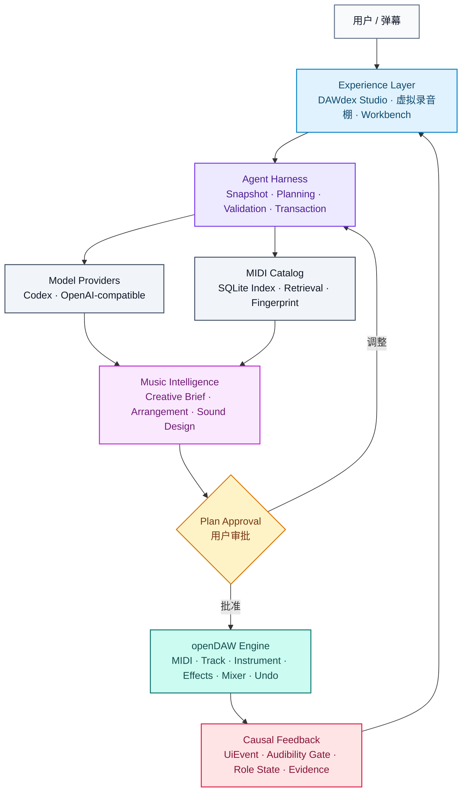

# DAWdex

[](https://github.com/andremichelle/openDAW)


> 弹幕驱动的 AI 虚拟录音棚。让一句话，真正进入可编辑的音乐工程。

**19 万级真实 MIDI · Plan Approval（计划审批）· openDAW 可编辑工程**

DAWdex 把自然语言、音乐素材、Agent 决策和专业 DAW 组织成一座看得见、听得到、
可以继续操作的虚拟录音棚。

用户负责说出想要的音乐结果。DAWdex 负责理解、检索、编排、验证和执行。最终留下的
不是一次性生成音频，而是一个可以播放、修改、替换和撤销的 openDAW 工程。

## 1. 品牌故事：把音乐制作变成一场可以指挥的演出

传统 DAW 很强，但要求用户先学会轨道、设备、效果器和复杂的工程操作。
Prompt-to-Song 很快，但经常只交付一个无法解释、难以局部修改的黑盒结果。

DAWdex 选择了第三条路：

> **保留专业 DAW 的控制力，把音乐制作的入口压缩成一句自然语言。**

用户可以说：

- “再炸一点，像最终 Boss 出场。”
- “钢琴柔一点，给人声留空间。”
- “保留 Keys，只让鼓和 Bass 更有力量。”

Producer Agent（制作人 Agent）把这些要求转成音乐决策。虚拟乐手把决策变成看得懂
的动作。openDAW 则保留所有真实的轨道、音符、设备、效果和 Undo（撤销）。

|          | 传统 DAW         | Prompt-to-Song | DAWdex                      |
| -------- | ---------------- | -------------- | --------------------------- |
| 输入     | 参数与工程操作   | 一次 Prompt    | 自然语言制作指令            |
| 输出     | 可控工程         | 黑盒音频       | 可继续编辑的 openDAW 工程   |
| 修改     | 手动定位每个对象 | 通常重新生成   | 指定角色、轨道和音乐目标    |
| 用户角色 | 工程操作者       | 结果接收者     | 制作决策者                  |
| 反馈     | 参数和波形       | 生成进度       | 乐手、房间、Plan 与真实工程 |

DAWdex 不是给 DAW 加一个聊天框。它把 AI 放进一条真实的音乐制作流程。

## 2. Demo：90 秒看见一次完整的 AI 制作过程

90 秒内，用户从一句弹幕出发，看见音乐意图如何被理解、安排和执行，并在 openDAW
中留下可以继续编辑的结果。

```mermaid
flowchart LR
    USER["用户弹幕"] --> PRODUCER["Producer<br/>采纳意图"]
    PRODUCER --> BRIEF["Creative Brief<br/>创作简报"]
    BRIEF --> RETRIEVAL["Grounded Retrieval<br/>可追溯音乐检索"]
    RETRIEVAL --> PLAN["Agent Plan<br/>制作计划"]
    PLAN --> APPROVAL{"Plan Approval<br/>用户审批"}
    APPROVAL -->|批准| DAW["openDAW<br/>写入工程"]
    APPROVAL -->|调整| BRIEF
    DAW --> AUDIBLE["Audibility Gate<br/>发声确认"]
    AUDIBLE --> BAND["虚拟乐手<br/>开始演奏"]
    BAND --> ITERATE["二次干预<br/>或 Undo"]

    classDef intent fill:#E0F2FE,stroke:#0284C7,color:#0C4A6E,stroke-width:1.5px;
    classDef intelligence fill:#EDE9FE,stroke:#7C3AED,color:#4C1D95,stroke-width:1.5px;
    classDef approval fill:#FEF3C7,stroke:#D97706,color:#78350F,stroke-width:1.5px;
    classDef engine fill:#CCFBF1,stroke:#0F766E,color:#134E4A,stroke-width:1.5px;
    classDef feedback fill:#FFE4E6,stroke:#E11D48,color:#881337,stroke-width:1.5px;

    class USER,PRODUCER intent;
    class BRIEF,RETRIEVAL,PLAN intelligence;
    class APPROVAL approval;
    class DAW engine;
    class AUDIBLE,BAND,ITERATE feedback;
```



### 90 秒演示节奏

| 时间     | 发生什么                                              |
| -------- | ----------------------------------------------------- |
| 0–30 秒  | 空舞台、用户弹幕、Producer 理解并采纳音乐要求         |
| 31–45 秒 | drums、bass、keys 乐手依次进入录音棚并接收任务        |
| 45–68 秒 | Plan 获得批准，音乐写入 openDAW；角色等待真实发声确认 |
| 68–90 秒 | 用户提出第二次干预，展示局部替换、Undo 和专业工作台   |

演示过程中，用户可以巡游六个空间：

- 演播大厅
- 鼓棚
- 吉他贝斯棚
- 键盘阁楼
- 控制室
- 休息室

乐队会议会展示 Plan、角色任务和执行证据。按 `Esc` 或点击“工作台”，舞台会收起，
直接露出 Agent 正在操作的同一个 openDAW 工程。

> **先有声音，后有表演。**
>
> Audibility Gate（发声闸门）只有在轨道确认可听后，才允许角色进入演奏状态。

## 3. 三种使用方式

### Live Agent（实时 Agent）

Studio 读取 openDAW Project Snapshot（工程快照），Producer Agent 调用可用模型、
检索音乐素材并返回结构化 Plan。用户批准后，系统执行真实工程修改。

### Guided Demo（引导演示）

点击顶栏 `↻` 可以进入 90 秒 Showcase。它沿用 Live Agent 的 UI Event Contract
（界面事件协议），完整呈现从用户请求到专业工作台的交互节奏。

Guided Demo 聚焦完整的现场体验；Live Agent 负责实时规划与工程执行。

### openDAW Workbench（专业工作台）

按 `Esc`、点击工作台按钮或使用 `?workbench=1`，可以收起虚拟录音棚并直接操作
openDAW。工作台打开期间事件持续同步，返回录音棚后立即呈现最新工程状态。

## 4. 核心能力

### Grounded Music Retrieval（可追溯音乐检索）

授权 MIDI 资料共 194,553 个文件，其中 193,320 个通过目录校验并可进入完整索引。
系统先按角色、长度和音乐特征缩小候选，再交给 Agent 做编排判断。

底层以 Asset ID（素材唯一标识）保留可追溯关系；界面聚焦音乐选择、角色任务和工程
影响。

### Plan Approval（计划审批）

Agent 先把用户语言整理成 Creative Brief 和结构化 Plan。Plan 说明音乐方向、素材、
音色、效果、保留对象和执行动作。没有用户批准，就不修改工程。

### Controlled DAW Execution（受控 DAW 执行）

DAWdex 可以操作：

- Transport（播放控制）与 Loop（循环范围）
- Track（轨道）与 Region（片段）
- MIDI Transform（MIDI 变换）
- Instrument（乐器）与 Effect（效果器）
- Automation（自动化）
- Bus、Send 与 Routing（总线、发送与路由）

所有动作都经过 Capability Registry（能力白名单）和 Target ID Validation
（目标标识校验）。模型负责音乐判断，Harness 在经过验证的能力范围内完成执行。

### Transactional Undo（事务级撤销）

一轮批准的工程修改会合并为一个 Undo 步骤。执行失败时，本轮事务回滚，此前可以播放
的工程保持不变。

### Role-aware Sound Design（角色化声音设计）

MIDI 决定“演奏什么”，TrackSound（轨道声音设计）决定“听起来像什么”。系统可以
为鼓轨选择经试听批准的 Playfield TR-808 / TR-909，为 Bass 与 Keys 设计
Vaporisateur 合成器音色；当工程已经导入兼容资产时，也可以选择 Soundfont 或
Nano。每条轨道还可以设置 Mixer、Compression、Delay、Reverb、Stereo 与
Maximizer 等制作参数。

### Causal UI（因果界面）

角色、房间和动画不维护另一套虚构状态。Plan、Apply、Undo、Transport 和轨道可听
状态由统一的 UI Event Contract 驱动，并通过 Operation Reference（操作引用）
追踪。

屏幕不是装饰。它是音乐工程状态的可视化投影。

## 5. 项目交付内容

| 交付物                  | 内容                                                                |
| ----------------------- | ------------------------------------------------------------------- |
| DAWdex Studio           | 弹幕输入、Plan 审批、虚拟录音棚、六房间巡棚和 openDAW 工作台        |
| Producer Agent          | Creative Brief、结构化 Plan、模型接入与音乐编排                     |
| MIDI Retrieval Engine   | 本地索引、候选排序、Fingerprint（音乐指纹）去重和素材调度           |
| openDAW Execution Layer | MIDI 解析、角色轨道创建或替换、声音设计、效果和 Mixer               |
| DAW Control Plane       | Transport、Track、Region、Instrument、Effect、Automation 与 Routing |
| Safety & Recovery       | 能力校验、目标校验、用户审批、事务执行、失败回滚和 Undo             |
| UI Event Contract       | Agent、openDAW、角色动画、走带状态和执行证据的统一事件协议          |
| Guided Demo             | 90 秒引导演示、首次入场、电梯过场、房间巡游和乐队会议               |
| Project Documentation   | 产品定义、PRD、架构、技术方案、前端设计、Demo Runbook 与协作规范    |

## 6. 虚拟录音棚：前端不是皮肤

DAWdex 的前端把 openDAW 翻译成一部可以操作的动画片：

| 音乐系统                           | 虚拟录音棚                       |
| ---------------------------------- | -------------------------------- |
| Track（轨道）                      | 乐手                             |
| Instrument / Device（乐器 / 设备） | 房间中的乐器和器材               |
| Transport（走带）                  | 全局播放与节拍状态               |
| Agent State（Agent 状态）          | 思考、准备、排队、演奏和失败动作 |
| User Request（用户请求）           | 屏幕内弹幕                       |
| Plan / Operation（计划 / 操作）    | 乐队会议与执行证据               |
| openDAW Project（工程）            | 整座录音棚背后的真实音乐状态     |

弹幕是用户指挥乐队的常驻自然语言入口。Producer 常驻控制室；drums、bass、keys
承担可听轨道角色。角色动作、房间状态和 openDAW 工程由同一份事件事实驱动。

这使非专业用户能看懂“音乐正在怎样被制作”，专业用户也能随时掀开舞台，回到完整
DAW 工作台。

## 7. 技术架构



Harness 位于模型和 DAW 之间。它决定模型可以看见什么、能修改什么、何时需要审批、
怎样验证目标、如何执行和如何撤销。

这条边界让 Agent 有足够的音乐判断空间，同时让每一次修改都保持可解释、可验证和
可恢复。

## 8. 本地运行

### 环境要求

- Node.js 23 或更高版本
- npm 11
- Rust 与 `cargo`，用于构建 Studio WASM

### 启动 Studio

```bash
git clone https://github.com/treefing3rs/DAWdex.git
cd DAWdex/opendaw
npm install
npm run build-wasm
npm run dev:dawdex-studio
```

打开 [http://localhost:8080](http://localhost:8080)。

- 点击顶栏 `↻` 启动 Guided Demo；
- 按 `Esc` 在虚拟录音棚与 openDAW Workbench 之间切换。

### 建立 MIDI 索引

首次克隆或 `midi/easy/` 内容变化后运行：

```bash
cd DAWdex/opendaw
npm run index:midi -w @dawdex/agent-server
```

索引生成在 `midi/.dawdex/catalog.sqlite`，只保留在本地。

### 启动 Agent Server

另开终端：

```bash
cd DAWdex/opendaw
npm run dev:dawdex-agent
```

Provider 配置和接口说明见
[技术方案](docs/DAWdex_TechSpec.md)。完整演示流程见
[Demo Runbook](docs/DEMO_RUNBOOK.md)。

## 9. 仓库结构

```text
DAWdex/
├── opendaw/
│   └── packages/
│       ├── app/studio/          DAWdex Studio 与 openDAW 前端
│       └── server/dawdex-agent/ Producer Agent、Provider 与 MIDI API
├── midi/easy/                   MIDI 资料库
├── docs/                        产品、架构、技术、设计和 Demo 文档
├── CONTRIBUTING.md              GitHub Flow 与协作规范
└── VERSION                      项目版本
```

## 10. 技术栈

openDAW · TypeScript · Rust/WASM · Vite · SQLite · Codex app-server ·
OpenAI-compatible API · Node.js · MIDI

## 11. 文档

- [当前状态与验证结果](docs/STATUS.md)
- [完整产品定义](docs/PRODUCT_VISION.md)
- [产品需求文档](docs/PRD_DAWdex.md)
- [系统架构](docs/architecture.md)
- [技术方案](docs/DAWdex_TechSpec.md)
- [前端设计](docs/design/README.md)
- [Demo Runbook](docs/DEMO_RUNBOOK.md)
- [文档索引](docs/README.md)
- [贡献指南](CONTRIBUTING.md)

## 12. 团队

- **Experience & Story**：UI/UX、虚拟录音棚、角色和 Demo
- **Agent & Music Intent**：Provider、Creative Brief、Plan 和 MIDI 检索
- **Music Pipeline & Integration**：数据、质量闸门和 openDAW 工程执行

团队使用短生命周期分支和 Pull Request 协作，保持 `main` 始终可以演示。

## 13. 上游与许可

DAWdex 构建在 [openDAW](https://github.com/andremichelle/openDAW) 之上，并保留其
目录结构、版权与许可证声明。

发布或分发时，需要同时遵守 openDAW、第三方依赖以及音乐素材各自的许可。密钥、
本地 SQLite 索引、构建产物和未经确认可分发的音频或 MIDI 资产不进入 Git。
