# DAWdex

[](https://github.com/andremichelle/openDAW)


> 弹幕驱动的 AI 乐队 Agent。让一句话，真正进入可编辑的音乐工程。

**SQLite MIDI 检索 · Plan Approval（计划审批）· 可追溯 DAW 操作**

DAWdex 把自然语言、音乐素材、Agent 决策和专业 DAW 串成一条看得见、听得到、
可以继续操作的音乐制作链路。

用户负责说出想要的音乐结果。DAWdex 负责把语言转换成结构化音乐意图、可理解的
编排步骤和可追溯的 DAW 操作。最终留下的不是一次性生成音频，而是可以继续编辑的
openDAW 工程对象。

> **公有代码的证据边界：** 可核对的实现包括 Agent 结构化 Plan、SQLite
> 检索器代码、用户审批门、DAW 写入与失败回滚，以及 Plan 到实际操作的引用。
> 当前点击 `↻` 可运行 Drums、Bass、Keys 三角色固定事件演示；它证明界面叙事
> 与事件契约，不冒充实时 Agent、MIDI 检索或 DAW 写入。
> 一个选定乐器、一条可编辑轨道和固定的
> `Intro → Verse → Chorus → Bridge` 是本次**拟展示的前端切片**，尚未作为
> 公有分支可运行功能落地。多乐器、多轨和完整歌曲是后续产品方向。

## 1. 品牌故事：把音乐制作变成一场可以指挥的演出

传统 DAW 很强，但要求用户先学会轨道、设备、效果器和复杂的工程操作。
Prompt-to-Song 很快，但经常只交付一个无法解释、难以局部修改的黑盒结果。

DAWdex 选择了第三条路：

> **保留专业 DAW 的控制力，把音乐制作的入口压缩成一句自然语言。**

用户可以说：

- “再炸一点，像最终 Boss 出场。”
- “钢琴柔一点，给人声留空间。”
- “让主奏更有力量，但保留段落结构。”

Producer Agent（制作人 Agent）把这些要求转成音乐决策和可理解的编排步骤。
openDAW 则保留实际写入的轨道、音符和操作引用，让结果可以检查和继续编辑。

|          | 传统 DAW         | Prompt-to-Song | DAWdex                      |
| -------- | ---------------- | -------------- | --------------------------- |
| 输入     | 参数与工程操作   | 一次 Prompt    | 自然语言制作指令            |
| 输出     | 可控工程         | 黑盒音频       | 可继续编辑的 openDAW 工程   |
| 修改     | 手动定位每个对象 | 通常重新生成   | 指定角色、轨道和音乐目标    |
| 用户角色 | 工程操作者       | 结果接收者     | 制作决策者                  |
| 反馈     | 参数和波形       | 生成进度       | 乐手、房间、Plan 与真实工程 |

DAWdex 不是给 DAW 加一个聊天框。它把 AI 放进一条真实的音乐制作流程。

## 2. 当前可运行展示与拟接入切片

当前点击顶栏 `↻` 会运行一条固定的 90 秒 Guided Demo：观众弹幕被采纳，
Drums、Bass、Keys 依次领任务、进入演奏状态，并产生带 `operationRef` 的结果事件。
它用于证明弹幕、角色反馈和证据回执的界面叙事可以运行；这条时间线直接派发 UI
事件，不调用实时 Agent、SQLite 检索或 DAW Adapter 写入。

下面是正在接入的产品展示切片。它会把同一套产品意义收敛到一个乐器、一条可编辑
轨道和四个固定段落，让评委更容易核对语言、计划与工程结果：

### 拟接入的产品链路

```mermaid
flowchart LR
    USER["用户弹幕"] --> PRODUCER["Producer<br/>采纳意图"]
    PRODUCER --> BRIEF["Creative Brief<br/>创作简报"]
    BRIEF --> RETRIEVAL["Grounded Retrieval<br/>可追溯音乐检索"]
    RETRIEVAL --> PLAN["Arrangement Plan<br/>可理解的编排步骤"]
    PLAN --> APPROVAL{"Plan Approval<br/>用户审批"}
    APPROVAL -->|批准| DAW["openDAW<br/>写入工程"]
    APPROVAL -->|调整| BRIEF
    DAW --> TRACK["Editable Track<br/>一个乐器 · 一条轨道"]
    TRACK --> STRUCTURE["Song Structure<br/>Intro · Verse · Chorus · Bridge"]
    STRUCTURE --> EVIDENCE["Operation Evidence<br/>可追溯操作"]

    classDef intent fill:#E0F2FE,stroke:#0284C7,color:#0C4A6E,stroke-width:1.5px;
    classDef intelligence fill:#EDE9FE,stroke:#7C3AED,color:#4C1D95,stroke-width:1.5px;
    classDef approval fill:#FEF3C7,stroke:#D97706,color:#78350F,stroke-width:1.5px;
    classDef engine fill:#CCFBF1,stroke:#0F766E,color:#134E4A,stroke-width:1.5px;
    classDef feedback fill:#FFE4E6,stroke:#E11D48,color:#881337,stroke-width:1.5px;

    class USER,PRODUCER intent;
    class BRIEF,RETRIEVAL,PLAN intelligence;
    class APPROVAL approval;
    class DAW engine;
    class TRACK,STRUCTURE,EVIDENCE feedback;
```



### 当前 `↻` 的 90 秒节奏

| 时间     | 当前固定事件演示                                      |
| -------- | ----------------------------------------------------- |
| 0–18 秒  | 系统开场，用户弹幕与 AI 乐迷附和进入屏幕              |
| 18–30 秒 | Producer 采纳意见并给出结构化 Brief                   |
| 30–45 秒 | Drums、Bass、Keys 依次领取带引用的角色任务            |
| 45–68 秒 | 三个角色依次进入 queued / performing 状态             |
| 68–90 秒 | 第二次 Bass 干预与 Operation Result 收尾              |

虚拟乐队的产品方向会把这条机制扩展为六个可巡游空间：

- 演播大厅
- 鼓棚
- 吉他贝斯棚
- 键盘阁楼
- 控制室
- 休息室

乐队会议、工作台切换、多房间和多乐手逐轨进入都属于拟展示或产品方向，不作为
公有分支已经完成的证明。

## 3. 代码链路与体验方向

### Live Agent 代码链路

公有代码包含 Project Snapshot、结构化 Plan、SQLite 检索、用户审批和 DAW
写入/回滚的组成部分，并通过操作引用关联计划与执行结果。

### Guided Demo（当前固定事件演示）

点击 `↻` 会沿着 UI Event Contract（界面事件协议）播放固定的三角色时间线，
呈现弹幕、制作人采纳、角色任务、演奏状态与结果回执。它是可复现的界面演示，
不是实时模型或真实三轨工程写入。

单乐器、单轨、四段式会作为下一版展示切片接入；Live Agent 的公有代码已经提供
结构化规划与工程执行基础。

### openDAW Workbench（体验方向）

产品方向允许用户从虚拟录音棚进入底层 openDAW，直接检查和继续编辑工程。具体
工作台切换与事件同步体验应以公有分支实际可运行版本为准。

## 4. 核心能力

### Grounded Music Retrieval（可追溯音乐检索）

本地数据集曾为 194,553 个 MIDI 文件建立目录，其中 193,320 个通过校验并进入本地
SQLite 索引。公有仓库包含检索器与建库代码，但不分发这批 MIDI 数据或生成后的
`catalog.sqlite`；clean clone 不能直接复现 19 万条素材检索，必须另行准备获授权
的数据并在本地建库。

底层以 Asset ID（素材唯一标识）保留可追溯关系；界面聚焦音乐选择、角色任务和工程
影响。

### Plan Approval（计划审批）

Agent 先把用户语言整理成 Creative Brief 和结构化 Plan。Plan 说明音乐方向、素材、
音色、效果、保留对象和执行动作。没有用户批准，就不修改工程。

### Controlled DAW Execution（受控 DAW 执行）

公有代码可以核对：Harness 把获批 Plan 翻译成带目标标识的 DAW 写入；执行失败时
回滚本轮变更。拟展示切片会使用其中最小的一组能力创建单乐器、单轨四段结构，但该
组合尚未作为公有分支可运行功能落地。

### Traceable Editing（可追溯编辑）

公有代码通过 Operation Reference（操作引用）关联 Plan、目标对象和实际写入动作，
使评委可以核对“计划了什么”和“实际执行了什么”。

### Role-aware Sound Design（角色化声音设计）

MIDI 决定“演奏什么”，TrackSound（轨道声音设计）决定“听起来像什么”。拟展示
切片会选择一个乐器呈现这层关系；角色化音色、多乐器配置和更完整的混音是产品方向。

### Causal UI（因果界面）

角色、房间和动画不应维护另一套虚构状态。公有代码已有 Plan、Apply 和操作引用；
用这些事实驱动完整虚拟乐队角色状态，仍是后续前端产品方向。

屏幕不是装饰。它是音乐工程状态的可视化投影。

## 5. 公有代码证据与产品方向

| 层级              | 公有仓库可核对内容或状态                                              |
| ----------------- | --------------------------------------------------------------------- |
| Agent             | Creative Brief 与结构化 Plan                                          |
| MIDI Retrieval    | SQLite 建库、查询、候选排序与 Fingerprint（音乐指纹）去重代码         |
| Approval          | 用户批准后才进入工程执行的控制点                                      |
| DAW Execution     | 带目标标识的写入、失败回滚与 Operation Reference                     |
| Local Data        | 本地曾索引 193,320 条；数据集和生成后的 SQLite 库不随公有仓库分发     |
| Current Demo      | `↻` 启动 Drums、Bass、Keys 固定 UI 事件时间线                         |
| Proposed Demo     | 单乐器、单轨、固定四段式前端切片；尚非公有分支可运行功能              |
| Product Direction | 多乐器、多轨、完整歌曲、角色动画与六房间虚拟乐队体验                  |

## 6. 虚拟录音棚：前端不是皮肤

DAWdex 的前端把 openDAW 翻译成一部可以操作的动画片：

| 音乐系统                           | 虚拟录音棚                       |
| ---------------------------------- | -------------------------------- |
| Track（轨道）                      | 乐手                             |
| Instrument / Device（乐器 / 设备） | 房间中的乐器和器材               |
| Transport（走带）                  | 全局播放与节拍状态               |
| Agent State（Agent 状态）          | 思考、准备、排队、演奏和失败动作 |
| User Request（用户请求）           | 屏幕内弹幕                       |
| Plan / Operation（计划 / 操作）    | 乐队会议与执行证据               |
| openDAW Project（工程）            | 整座录音棚背后的真实音乐状态     |

弹幕是用户指挥乐队的自然语言入口。拟展示切片计划让 Producer 的 Plan 与一条真实轨道
同源；未来再让 drums、bass、keys 等角色扩展为多乐器、多轨的完整乐队体验。

这使非专业用户能看懂“音乐正在怎样被制作”，专业用户也能随时掀开舞台，回到完整
DAW 工作台。

## 7. 目标技术架构

下图同时包含公有代码事实和产品方向。当前可核对事实集中在结构化 Plan、SQLite
检索、审批门、DAW 写入/回滚和 Operation Reference；Experience 与完整角色反馈
仍需以实际落地版本验证。


Harness 位于模型和 DAW 之间。它把结构化音乐意图、编排步骤和目标对象连接起来，
并保留计划与实际工程操作之间的引用。

## 8. 本地运行

### 环境要求

- Node.js 23 或更高版本
- npm 11
- Rust 与 `cargo`，用于构建 Studio WASM

### 启动 Studio

```bash
git clone https://github.com/treefing3rs/DAWdex.git
cd DAWdex/opendaw
npm install
npm run build-wasm
npm run dev:dawdex-studio
```

打开 [http://localhost:8080](http://localhost:8080)。

- 点击顶栏 `↻` 运行当前三角色固定事件演示；
- 这一步不代表实时 Agent/MIDI/DAW 执行；
- 单乐器单轨四段式切片仍在接入。

### 建立 MIDI 索引

公有仓库不包含本地 19 万级 MIDI 数据集，也不包含生成后的 SQLite 库。只有在另行
准备获授权的 `midi/easy/` 数据后，才运行：

```bash
cd DAWdex/opendaw
npm run index:midi -w @dawdex/agent-server
```

索引生成在 `midi/.dawdex/catalog.sqlite`，只保留在本地。

### 启动 Agent Server

另开终端：

```bash
cd DAWdex/opendaw
npm run dev:dawdex-agent
```

Provider 配置和接口说明见
[技术方案](docs/DAWdex_TechSpec.md)。拟展示流程见
[Demo Runbook](docs/DEMO_RUNBOOK.md)。

## 9. 仓库结构

```text
DAWdex/
├── opendaw/
│   └── packages/
│       ├── app/studio/          DAWdex Studio 与 openDAW 前端
│       └── server/dawdex-agent/ Producer Agent、Provider 与 MIDI API
├── midi/easy/                   本地 MIDI 资料挂载约定（资产不进 Git）
├── docs/                        产品、架构、技术、设计和 Demo 文档
├── CONTRIBUTING.md              GitHub Flow 与协作规范
└── VERSION                      项目版本
```

## 10. 技术栈

openDAW · TypeScript · Rust/WASM · Vite · SQLite · Codex app-server ·
OpenAI-compatible API · Node.js · MIDI

## 11. 文档

- [完整产品定义](docs/PRODUCT_VISION.md)
- [产品需求文档](docs/PRD_DAWdex.md)
- [系统架构](docs/architecture.md)
- [技术方案](docs/DAWdex_TechSpec.md)
- [前端设计](docs/design/README.md)
- [Demo Runbook](docs/DEMO_RUNBOOK.md)
- [文档索引](docs/README.md)
- [贡献指南](CONTRIBUTING.md)

## 12. 团队

- **Experience & Story**：UI/UX、虚拟录音棚、角色和 Demo
- **Agent & Music Intent**：Provider、Creative Brief、Plan 和 MIDI 检索
- **Music Pipeline & Integration**：数据、质量闸门和 openDAW 工程执行

团队使用短生命周期分支和 Pull Request 协作，保持 `main` 始终可以演示。

## 13. 上游与许可

DAWdex 构建在 [openDAW](https://github.com/andremichelle/openDAW) 之上，并保留其
目录结构、版权与许可证声明。

发布或分发时，需要同时遵守 openDAW、第三方依赖以及音乐素材各自的许可。密钥、
本地 SQLite 索引、构建产物和未经确认可分发的音频或 MIDI 资产不进入 Git。
